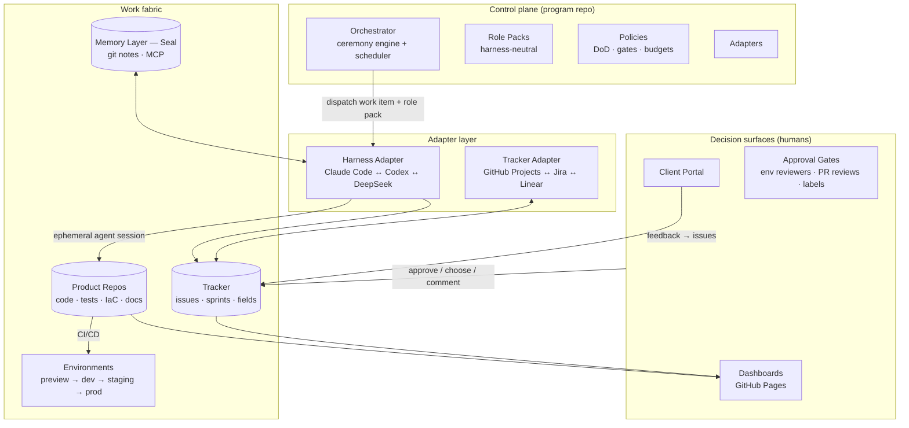

# AI-Native SDLC — Enterprise Delivery Blueprint

**An autonomous, traceable, pluggable Agile delivery system built on Claude Code (or any coding harness), Git-native coordination, and human-in-the-loop decision gates.**

Working name: **Foundry** (rename freely). Version 0.1 — design blueprint.

---

## 1. Design principles

Everything else in this document derives from six principles. If a mechanism violates one of these, it's wrong.

**P1 — The tracker is the message bus.** Agents never coordinate through hidden context, shared memory hacks, or side channels. All inter-agent communication happens through work items: issue comments, field transitions, labels, PR reviews. This is what makes the system traceable by construction — the audit trail isn't a logging feature bolted on, it *is* the coordination mechanism. A human reading the board sees exactly what every agent sees.

**P2 — Every agent action produces a durable, visible artifact.** No agent "just knows" something or "just does" something. Requirement extracted → PRD section in a repo. Estimate produced → estimation record on the issue. Code written → signed commit + PR. Test run → published HTML report. Decision made → ADR. Status → dashboard page. If it didn't produce an artifact, it didn't happen.

**P3 — Humans decide, agents execute and propose.** Human-in-the-loop is not "human types instructions." Humans interact through decision surfaces: approve/reject buttons (GitHub environment gates, PR reviews, label-based approvals), option pickers (ADRs with 2–3 costed options), and feedback forms (client portal). Agents bring humans *decisions with tradeoffs*, never walls of text requiring synthesis.

**P4 — Roles are pluggable packs; harnesses are interchangeable engines.** A "Product Manager agent" is not a Claude Code feature — it's a **role pack**: a harness-neutral bundle of skills, tool permissions, policies, and an identity. The pack compiles down to a Claude Code plugin, a Codex `AGENTS.md`, or a DeepSeek/OpenCode config. Swap the engine, keep the org.

**P5 — Git is the substrate.** Signed commits per agent identity, commit trailers for traceability, git notes for metadata (estimation actuals, review provenance), CODEOWNERS for review routing, protected branches + required checks + environments for gates, tags/releases for sign-off points, merge queues for throughput. Prefer a native git feature over custom infrastructure every time.

**P6 — Assume agents fail; make failure cheap, visible, and recoverable.** "Foolproof" is not achievable and shouldn't be claimed. What *is* achievable: small batches, hard budgets, automatic escalation, harness diversity to break correlated errors, and reversibility everywhere. Enterprise-grade means *failure is boring*, not absent.

---

## 2. System architecture



**The control plane is a repo** (`program/`), not a service. Ceremonies are scheduled workflows. Role packs, policies, adapters, and dashboards are versioned files. Changing how the team works = a PR to the program repo, reviewed like anything else. The system's own evolution is traceable.

**Agent sessions are ephemeral; state is external.** Every dispatch spins up a fresh harness session that rehydrates from: (a) the work item and its links, (b) repo conventions and ADRs, (c) the memory layer. Nothing important lives in a context window. This is what makes harness swapping possible and crashes harmless.

**Runtime.** GitHub Actions is the trigger fabric (issue events, cron for ceremonies, `workflow_dispatch` for human buttons). Long-running agent sessions execute on self-hosted runners or a small dispatch service (a queue + worker is enough; Temporal if you want durability guarantees). Headless invocation: `claude -p` with `--allowedTools` / plugin config; `codex exec`; OpenCode-style CLI for DeepSeek and others.

---

## 3. Role catalog

Each role is a pack with its own **bot identity** (GitHub machine account, signing key, scoped PAT). Attribution is cryptographic: every commit is signed by the role that made it, every comment authored by a named bot. `git log --format='%GS %s'` tells you who did what.

| Role | Owns | Produces | Write scope |
|---|---|---|---|
| **Delivery Orchestrator** | Ceremonies, assignment, escalation, capacity | Sprint plans, standup digests, escalation threads | Tracker fields, program repo |
| **Product Manager / BA** | Requirements, backlog, priorities | PRDs, user stories, acceptance criteria (Gherkin), change-request impact analyses | `prds/`, `requirements/`, tracker |
| **Architect** | System design, tech choices, conventions | ADRs (options + costs), scaffolds, design diagrams (Mermaid/C4), review of structural PRs | `adrs/`, scaffolding PRs |
| **Developer** (N instances, per domain/repo) | Implementation | Branches, signed commits, PRs, inline docs | Feature branches only |
| **QA Engineer** | Quality verdicts | Test plans, automated tests (as PRs), QA reports (HTML), bug reports with repro | `tests/`, bug issues, `qa:` labels |
| **DevOps / SRE** | CI/CD, environments, releases, incidents | Pipelines, IaC, release trains, rollback runbooks, incident issues | `infra/`, `.github/workflows/` |
| **Tech Writer** | Docs, release notes, demo scripts | Docs PRs, release notes from trailers, annotated demo walkthroughs | `docs/` |
| **Delivery Manager** | Client-facing state | Status reports, estimation docs, demo packages, RAID log | Client portal content |

Notes:

- **QA has a veto.** A `qa:rejected` label blocks story closure regardless of what the developer agent claims. Three rejections on one story auto-escalates to a human.
- **Developer agents never touch `main`.** Protected branches + required checks + CODEOWNERS make this structurally impossible, not behaviorally requested.
- **CODEOWNERS routes reviews to roles:** `/tests/` → QA bot, `/adrs/` → human architect, `/infra/prod/` → human DevOps lead, everything else → cross-review (see §11).

### Role pack format (harness-neutral)

```
role-packs/product-manager/
├── pack.yaml          # identity, harness compat, model prefs
├── charter.md         # mission, boundaries, escalation rules
├── skills/            # markdown skills (requirement-extraction.md, gherkin-authoring.md, ...)
├── tools.yaml         # allowed tools + MCP servers (e.g. Granola, tracker adapter)
├── policy.yaml        # budgets, forbidden actions, HITL triggers
└── templates/         # PRD template, story template, CR template
```

A compiler renders this per harness: Claude Code plugin (skills + `settings.json` + MCP config), Codex (`AGENTS.md` + sandbox policy), others via their config surface. **Pack changes are PRs** — the team's "training" is reviewed and versioned.

---

## 4. Work item taxonomy and the traceability spine

Canonical hierarchy (mapped by the tracker adapter to GitHub or Jira constructs):

**Requirement (REQ-###)** → **Epic** → **Story / Bug / Task** → **Branch** → **Commits** → **PR** → **Checks & QA verdict** → **Release** → **Deployment**

The spine is enforced with git primitives:

- **Branch naming:** `story/PROJ-142-payment-retry` — machine-parseable, checked by a lightweight CI job.
- **Commit trailers** (enforced by commit-msg policy in CI):
  ```
  Implement idempotent retry for payment webhook

  Work-Item: acme/payments#142
  Requirement: REQ-031
  Agent-Role: developer-backend
  Harness: claude-code/2.x
  ```
- **Git notes** (`refs/notes/foundry`) attach metadata without polluting history: estimation actuals, review provenance, cost per story. This is exactly Seal's storage model — Seal *is* the memory layer here (§12).
- **PR template** requires linked work item, DoD checklist, test evidence link. A **DoD bot check** (policy-as-code, `policies/dod.yaml`) fails the PR if links are missing, coverage delta is negative, or an architectural change lacks an ADR reference.
- **Traceability matrix is generated, never authored:** a CI job walks REQ → epic → story → PR trailers → test report → release tag and publishes an HTML matrix to the dashboard. Client-visible. If a requirement has no green path to a deployed release, it shows red — that's your real project status, computed from ground truth.
- **Releases and sign-offs are tags.** A signed annotated tag by the human release approver *is* the sign-off record. Release notes are compiled from trailers by the Tech Writer agent.

---

## 5. Ceremonies — how each runs autonomously

Every ceremony is a scheduled workflow in the program repo. Every ceremony ends in artifacts, not vibes.

### 5.1 Backlog refinement (2×/week, cron)
1. PM agent pulls `status:needs-refinement`, decomposes epics into stories, writes acceptance criteria as Gherkin scenarios (these become QA's test plan — one artifact, two consumers).
2. Architect agent adds technical notes, flags stories needing an ADR.
3. **Ensemble estimation** — the AI version of planning poker: three independent estimator sessions (ideally *different harnesses*: Claude Code, Codex, DeepSeek) each produce a three-point estimate (optimistic/likely/pessimistic) with reasoning, posted as structured comments. If the spread exceeds threshold, the orchestrator opens a discussion thread on the issue and tags a human. Independent estimates from decorrelated models is a genuine improvement over human planning poker, and the disagreement is visible on the ticket.
4. Story exits refinement only with: acceptance criteria, estimate + confidence, dependencies linked, `ready` label.

### 5.2 Sprint planning (sprint boundary, HITL gate)
1. Orchestrator computes capacity from **trailing actual velocity** (per role, from git notes actuals — not from optimism).
2. Proposes a sprint scope as a **Sprint Plan issue**: scope table, dependency graph (Mermaid), projected burndown, risk notes, explicit cut-line ("if we're wrong, these two stories drop first").
3. **Human gate:** PM/client approves via label or portal button. No approval, no sprint start. Iteration field set only after approval.

### 5.3 Daily standup (cron, generated — never self-reported)
The digest is computed from *events*: commits pushed, PRs opened/merged, checks failed, `blocked` labels, budget consumption. Agents don't write "what I did yesterday" — the system reports what actually happened. Blockers older than 24h auto-escalate. Digest posts to the dashboard and Slack. Humans skim in 60 seconds.

### 5.4 Sprint review / client demo (sprint end)
1. DevOps agent deploys the sprint increment to the **staging/demo environment**.
2. Tech Writer agent generates a **demo package**: walkthrough script mapped to acceptance criteria, **annotated screenshots captured via Playwright** for each completed story, links to the live demo env, and a "what changed / what's next" one-pager.
3. Delivery Manager agent publishes it to the client portal. Client walks through the live environment; feedback submitted via portal form → auto-filed as triaged issues.
4. Acceptance = client approval per story on the portal, recorded as a label + portal record. That approval is a queryable artifact.

### 5.5 Retrospective (sprint end, metrics-driven)
Inputs are measurements, not feelings: cycle time by stage, review rounds per PR, QA rejection rate, escaped defects, **estimate-vs-actual error by story size and by harness**, cost per story point. The orchestrator generates a retro report with 2–3 proposed process changes. Accepted changes become PRs to role packs or policies — **the team retro literally ships diffs to the team itself**, reviewed by a human.

---

## 6. Client engagement layer

### 6.1 Requirement gathering
Client calls are recorded/transcribed (Granola or a meeting bot via MCP). The PM agent processes the transcript into: extracted requirements (each gets a REQ-### ID with the transcript excerpt as provenance), open questions (filed as portal questions to the client), and a PRD update PR. **The client signs off on the PRD via the portal** — an explicit versioned approval, so "you never told us that" disputes are resolvable by artifact. Requirement changes after sign-off are Change Requests, full stop.

### 6.2 Estimation
Bottom-up from refined stories: three-point ensemble estimates roll up per epic, then a **Monte Carlo simulation** over historical velocity variance produces a delivery timeline as confidence bands (P50/P80/P95), rendered as a chart. Clients see a *distribution*, not a single date that will be wrong. Every sprint, actuals (from git notes) recalibrate the model — **the system learns its own velocity**, which is something human teams claim to do and rarely operationalize.

### 6.3 Change requests
Client files a CR on the portal → PM agent produces an impact analysis (affected requirements, stories, re-estimate, timeline delta chart) → human account lead + client approve → backlog updated with full lineage from CR to affected items.

### 6.4 The client portal
A static site (GitHub Pages, generated by CI from tracker + repo state) with role-filtered views: epic-level status, live traceability matrix, demo packages, sign-off queue, CR form, question threads. Clients see progress and decisions; they don't see internal agent churn. Portal actions (approve/reject/comment) round-trip into the tracker via a tiny API function.

---

## 7. Human-in-the-loop gates

Few, high-leverage, and visual. Too many gates and humans rubber-stamp; the design goal is that every gate is a real decision.

| Gate | Who | Surface | Mechanism |
|---|---|---|---|
| PRD / requirement sign-off | Client | Portal approve button | Versioned approval record |
| Sprint plan approval | PM / client | Sprint Plan issue | Label / portal button |
| ADR selection | Human architect | ADR PR with 2–3 costed options | PR review + merge |
| Merge to protected branch | Human or policy | PR review | Branch protection + CODEOWNERS |
| Staging → production | Release approver | **GitHub environment required-reviewer** | Literally a button; deploy blocks until pressed |
| Release sign-off | Client / PM | Portal + signed tag | Signed annotated tag |
| Budget breach / escalation | Delivery lead | Escalation issue with options | Choose option A/B/C |

Two rules keep this honest. **Agents propose options, not essays** — an ADR is "Option A: Kafka (cost, ops burden, fit) / Option B: SQS (…) / recommendation + why," and an escalation is "stuck because X; options: retry with approach B, descope to C, or need human pairing." And **every gate has an SLA with a default** — defined per gate in `policies/gates.yaml` (e.g., sprint plan auto-adopts the proposal after 48h of silence; production deploys never default to yes).

---

## 8. QA and Definition of Done

- **Test plan = acceptance criteria.** Gherkin scenarios written at refinement compile into the QA agent's test plan. QA implements automated tests in separate PRs (its own commits, its own signature — test authorship is attributable and reviewable).
- **QA report per story and per sprint:** HTML artifact — pass/fail matrix mapped to *requirements* (not just test names), coverage trend, defect density, flake list — published to the dashboard and attached to the release. This is the client-visible QA sign-off document.
- **Bugs carry repro:** failing test or scripted repro steps, severity, SLA clock. QA verdicts are labels (`qa:approved` / `qa:rejected` + reason), and closure is blocked without a verdict.
- **DoD is policy-as-code** (`policies/dod.yaml`), enforced by a required check: linked work item, trailers present, tests updated, coverage delta ≥ 0, docs touched if public surface changed, ADR linked if architectural, security scan clean. Nothing merges on a promise.
- **Escaped defects** (bugs found post-release) are tagged and traced back to the originating story and its QA verdict — this feeds retro and recalibrates where QA effort goes.

---

## 9. DevOps and release management

- **Environment ladder:** preview-per-PR (ephemeral) → dev (continuous) → staging (sprint demo, client-visible) → production (human gate). Preview environments are what make PR review *visual* — reviewers click a URL, not just read a diff.
- **IaC lives in repos**; the DevOps agent maintains pipelines and infrastructure through the same PR flow as everyone else. `infra/prod/` is CODEOWNERS-routed to a human.
- **Release train per sprint:** release PR → compiled release notes (from trailers) → staged rollout → signed tag on approval. Rollback runbook generated with every release, tested in staging.
- **Incidents:** SRE agent watches telemetry, files incident issues with evidence, runs the triage skill (severity, comms, mitigation options → human picks), and drafts the blameless postmortem after resolution. Incident → bug → fix PR → release is one traceable chain.

---

## 10. Visibility layer — nothing is text-only

Generated continuously by CI to GitHub Pages (internal) + the client portal (external):

- **Boards:** GitHub Projects v2 — sprint board, roadmap view, table-by-epic (custom fields: Iteration, Estimate, Confidence, Requirement-ID, Role, QA-verdict).
- **Dashboards:** burndown/burnup, cumulative flow, velocity + estimate error trends, cost per story (tokens + compute per work item — a metric human teams never had), RAG status per epic, DoD compliance.
- **Traceability matrix:** REQ → release, computed from trailers, red/green per requirement.
- **Diagrams as code:** Mermaid/C4 in ADRs and epics, rendered everywhere they appear.
- **Demo packages:** live environment links + Playwright-annotated walkthroughs.
- **Standup digest:** one page, generated from events.

Humans should be able to run this program *without reading a single agent transcript*. Transcripts are retained for audit, but the operating picture is entirely visual and artifact-based.

---

## 11. Swappability: the two adapter contracts

### 11.1 Tracker adapter (GitHub Projects ↔ Jira ↔ Linear)
A canonical schema — work item types, status state machine, fields (estimate, iteration, requirement-id, verdicts), links, comments — with per-tracker drivers: GitHub via GraphQL (Projects v2), Jira via REST, webhooks normalized into canonical events that drive the orchestrator. Agents and ceremonies speak only canonical operations (`create`, `transition`, `comment`, `link`, `set_field`, `query`). Swapping GitHub→Jira changes one config line and zero role packs. **Git remains the code-side source of truth in both cases** — trailers reference canonical IDs, so the spine survives a tracker migration.

### 11.2 Harness adapter (Claude Code ↔ Codex ↔ DeepSeek ↔ …)
One dispatch contract:

```yaml
dispatch:
  work_item: acme/payments#142
  role: developer-backend
  harness: claude-code        # or codex | deepseek | opencode
  repo: acme/payments
  budget: { tokens: 400k, wall_clock: 45m, max_retries: 2 }
expected_outputs: [branch, commits, pr, comments, status]
```

The runner compiles the role pack for the target harness, injects tool allowlists and MCP config, executes headlessly, and normalizes outputs. Anything the contract can't express for a given harness degrades gracefully (e.g., a harness without MCP gets tracker access via CLI shims).

**Harness diversity is a reliability feature, not just vendor hedging:**
- **Cross-harness review:** a PR authored by Claude Code is reviewed by a Codex session (and vice versa). Correlated blind spots — the failure mode of single-model pipelines — get broken by decorrelated reviewers.
- **Ensemble estimation** (§5.1) across harnesses.
- **Escalation ladder:** stuck agent → retry → *retry on a different harness* → human. Often a different model unsticks a task before a human ever sees it.
- **Routing by measured fit:** the retro metrics include per-harness quality/cost per task type; routing rules in `policies/routing.yaml` evolve from evidence.

Single-harness mode works fine — you lose diversity benefits, nothing else.

---

## 12. Memory: what persists between ephemeral sessions

Sessions are disposable; three stores are not:

1. **Tracker + repos** — the operational truth (P1, P2).
2. **Conventions & decisions** — ADRs, role-pack skills, `CONVENTIONS.md` per repo. Updated only via reviewed PRs.
3. **Engineering memory — Seal.** Intent, gotchas, decision rationale, and agent-to-agent handoff context, stored in **git notes** and served over **MCP** to every agent session at rehydration. This is precisely the gap Seal targets: at AI commit velocity, "why is this like this" evaporates unless it's captured at the commit and retrievable at the next session. Foundry without a memory layer re-litigates its own decisions every sprint; with it, sprint 12 agents are measurably better than sprint 1 agents on the same codebase.

Retro-accepted learnings graduate from memory into role-pack skills via PR — ephemeral observation → durable capability, with a human reviewing the promotion.

---

## 13. Guardrails, budgets, escalation

- **Least privilege per role:** scoped fine-grained PATs; developer bots can't touch settings, QA bots can't push code outside `tests/`, nobody but the release gate deploys prod.
- **Budgets per work item** (tokens, wall-clock, retries) in `policy.yaml`; breach → work pauses, escalation issue with a spend summary and options. Cost is a first-class, per-story, dashboard-visible metric.
- **Escalation ladder:** retry → alternate approach (agent must state what it will do differently) → alternate harness → `needs-human` with a structured summary (goal, attempts, blocker, options A/B/C). Humans are consulted with decisions, never dumped a transcript.
- **Deadlock rules:** QA rejects ×3 → human; two agents disagree in a thread beyond N rounds → human; dependency cycle detected → orchestrator escalates.
- **Blast radius:** protected branches, environment gates, preview-only infra changes for agents, mandatory rollback plan per release. Nothing an agent can do unsupervised is irreversible.
- **Audit:** it's all git + tracker events + signed commits. The audit log is the system.

---

## 14. Program repo layout

```
program/
├── prds/                      # product requirement docs (client-signed versions tagged)
├── requirements/              # REQ index + provenance (transcript excerpts)
├── adrs/                      # architecture decision records
├── role-packs/                # §3 — one dir per role
├── ceremonies/                # refinement.yaml, planning.yaml, standup.yaml, review.yaml, retro.yaml
├── policies/                  # dod.yaml, gates.yaml, budgets.yaml, routing.yaml
├── adapters/
│   ├── tracker/               # github/, jira/
│   └── harness/               # claude-code/, codex/, deepseek/
├── dashboards/                # static site generator + views
├── portal/                    # client portal generator + approval API
├── compiler/                  # role-pack → harness config compiler
└── .github/workflows/         # ceremony crons, dispatchers, dashboard builds
```

Product repos stay clean: code, tests, IaC, docs, `CONVENTIONS.md`, CODEOWNERS, PR template, DoD check. Multi-repo work is coordinated through the tracker (cross-repo linked items) and released as trains.

---

## 15. Rollout — do not boil the ocean

**Phase 0 (weeks 1–2): prove the spine.** One product repo, GitHub-only, three roles (Orchestrator, Developer, QA). Trailers, DoD check, protected branches, human merge gate, preview envs. Success = a story flows REQ→deploy with zero untracked actions.

**Phase 1 (weeks 3–5): the team.** All roles. Ceremonies live. Dashboards + standup digests. Ensemble estimation (single harness, three sessions). First real sprint with a human PM approving plans.

**Phase 2 (weeks 6–9): the client.** Portal, transcript→PRD pipeline, Monte Carlo estimation, demo packages, CR flow, release sign-off tags. First external demo.

**Phase 3 (weeks 10+): pluggability + learning.** Jira adapter. Second harness + cross-harness review + routing. Seal integration for memory. Retro→role-pack promotion loop. Multi-repo release trains.

Each phase ships value alone; stop anywhere and you still have a working, more-automated delivery org than you started with.

---

## 16. Honest risks (and what actually mitigates them)

- **Correlated agent error** — the big one. Mitigation: cross-harness review, human gates at irreversible points, small batches. Not mitigated by "better prompts."
- **Garbage requirements in, confident garbage out.** Mitigation: provenance-linked REQs, client sign-off on PRDs, PM agent forced to file open questions rather than assume.
- **Gate fatigue.** If humans rubber-stamp, HITL is theater. Mitigation: few gates, options-not-essays, SLAs with sane defaults, and ruthless pruning of low-signal gates at retro.
- **Cost runaway.** Mitigation: per-story budgets, cost-per-point on the dashboard, routing cheap tasks to cheap harnesses.
- **Flaky autonomy loops** (agent thrash, review ping-pong). Mitigation: deadlock rules, retry ceilings, escalation ladder.
- **The tracker adapter is where abstractions go to die.** Jira and GitHub Projects have real impedance mismatches (iterations vs sprints, field models). Mitigation: keep the canonical schema minimal; resist modeling every tracker feature.

The claim this system can honestly make is not "no defects" — it's **every action attributable, every decision recorded, every failure visible within hours, and nothing irreversible without a human**. That is a stronger guarantee than most human Agile teams actually deliver.
